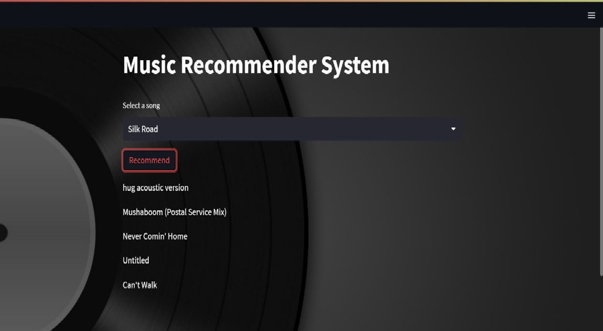

<h1 align="center"> Music Recommendation System</h1>


# Introduction

Music Recommendation System / Content Based Recommendation where based on entered preferences music is recommended.
- **used dataset** - 1 million song dataset
- **Libraries Used** - Pandas , Numpy , Streamlit , Pickle


# Output
<p align="center">

</p>


# Local Development

- To clone copy the following command in your terminal and start development.

```sh
git clone https://github.com/nidhiss29/music-recommendation-system-project.git
```

-or download a zip file

- cd into the directory

```sh
cd music-recommendation-system
```
- In anaconda prompt cd into the folder and open

```sh
jupyter notebook
```
- Get dataset from the drive and run the given jupyter file 
- Further open python file provided named app.py in terminal write command(within project directory)
```sh
streamlit app.py
```


<br> Dataset present on Drive
https://drive.google.com/drive/folders/1rliIZmJ7-IjIBhn-nsnbWbDXuS7Nqjv5?usp=sharing
